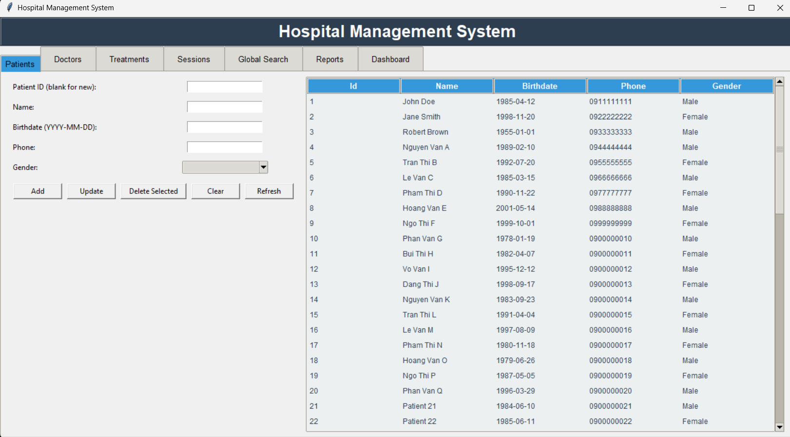
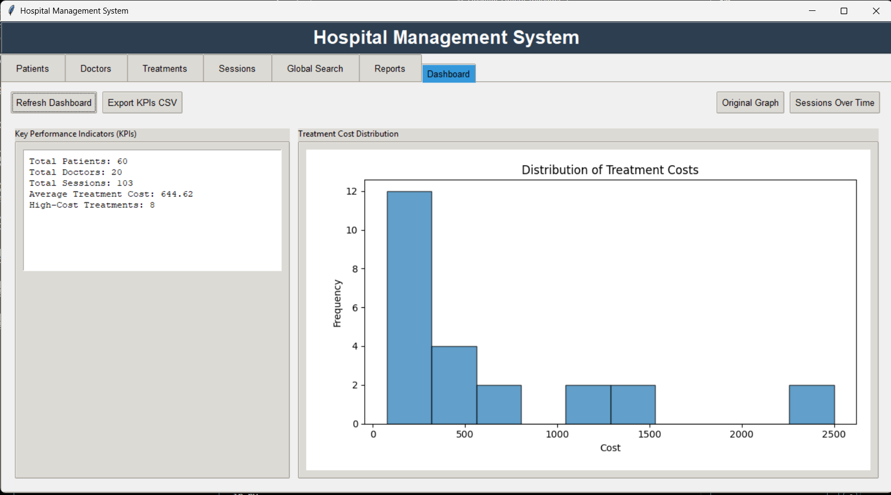

HOSPITAL-PATIENT-MANAGER_1/
├── .venv/                         # Python virtual environment
├── .vscode/                       # VS Code configuration (optional)
│   └── settings.json
├── app/                           # Core application source code
│   ├── __pycache__/               # Python bytecode cache (ignored by Git)
│   ├── db/                        # Database interactions and setup    
│   │   ├── connection.py          # Database connection/configuration helper
│   │   ├── schema.sql             # SQL script for creating tables/structure
│   │   └── seed.sql               # SQL script for initial data population
│   ├── dashboard.py               # Logic for the staff dashboard/analytics view
│   ├── main.py                    # Main application/server entry point
│   ├── queries.py                 # Raw or complex database query functions
│   └── services.py                # Business logic/service layer (e.g., patient check-in logic)
├── latex/                         # Placeholder for documentation/reports 
├── requirements.txt               # Project dependencies 
├── README.md                      # Project overview and setup instructions
└── .env.example.txt               # Example for environment variables (DB credentials, secret keys)


-----

#  Hospital Patient Manager

A Python application designed for managing patient data and administrative tasks within a hospital or clinic setting.

##  Technologies

This project is implemented using a combination of Python, MySQL, and GUI libraries to ensure efficient data management and user interaction. Key technologies and tools include:

  * **Programming Language:** **Python 3.14**
  * **Database Management System:** **MySQL 8.4**
  * **GUI Framework:** **Tkinter** (for the desktop interface)
  * **Database Connectivity:** `mysql-connector-python`
  * **IDE/Development Tools:** VSCode
  * **Version Control:** GitHub

-----
testing

## setup & Installation

Follow these steps to set up the environment and initialize the database.

### 1\. Python Requirements

Create and activate your virtual environment, then install the necessary Python packages:

1.  **Clone the Repository:**
    ```bash
    git clone <repository-url>
    cd HOSPITAL-PATIENT-MANAGER_1
    ```
2.  **Set up Virtual Environment:**
    ```bash
    python -m venv .venv
    source .venv/bin/activate  # Use '.venv\Scripts\activate' on Windows
    ```
3.  **Install Dependencies:**
   <!-- end list -->
    ```bash
    > must install pymysql, matplotlib before hand
    > **Note:** We recommend the following in your `requirements.txt`:

### 2\. Database Initialization (MySQL)

You must manually set up the database schema and initial data.

1.  **Configure Connection:**
      * Fill in your MySQL credentials (hostname, database name, username, password) in the **`db.connections.py** configuration file in the project root. The application will read this information via `app/db/connection.py`.
2.  **Create Schema:**
      * Open your MySQL client (Workbench, CLI, etc.) and **execute the SQL commands** contained within **`app/db/schema.sql`**. This creates the required tables (e.g., patients, services).
3.  **Seed Data:**
      * Next, execute the SQL commands contained within **`app/db/seed.sql`**. This populates the tables with necessary initial data, test records, or administrative accounts.

### 3\. Running the Application

Once the dependencies are installed and the database is configured, you can launch the application.

  * **Using the Python Interpreter:**
    The application is a standard desktop program. Run the main file directly using the Python interpreter:
    ```bash
    python app/main.py
    ```
  * **Using IDE Run Button:**
    You can also use the standard "Run" or "Debug" button in your IDE (like VSCode) to execute the `app/main.py` file directly.

-----

## Graphical User Interface (GUI)

The application uses **Tkinter** to provide a responsive, native desktop experience for staff.

  * []
  * []
  

-----

##  Video Demonstration

A link to the application demonstration is provided below:

  * **YouTube Demo Link:** [Placeholder: Insert YouTube URL Here]

-----

What content would you like to draft next? We could define the contents for the **`requirements.txt`** file.